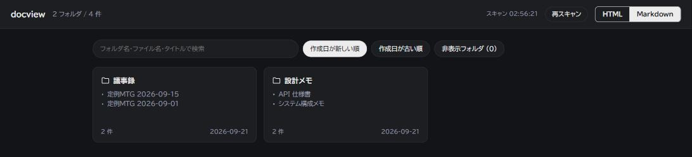
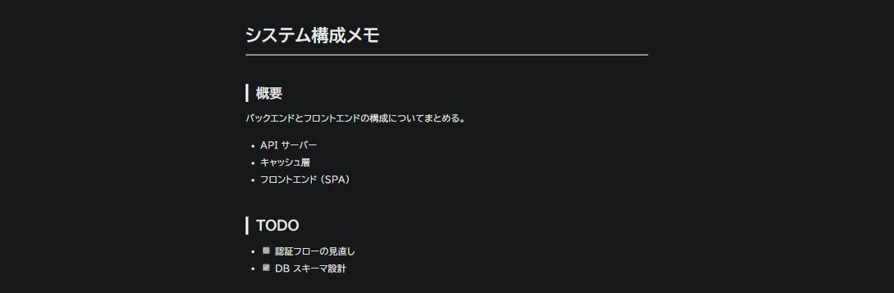

# docview

指定フォルダ配下の HTML / Markdown ファイルをフォルダ単位で一覧・検索できる、ローカル起動のドキュメントビューアです。

依存パッケージなし（npm install 不要）で、Node.js だけで動作します。`127.0.0.1` にのみ待ち受けるため、外部への公開は想定していません。

## スクリーンショット

フォルダ単位でファイルをまとめて表示する一覧画面（HTML / Markdown の切り替え、検索、並び替えに対応）。



Markdown ファイルを開いたときのビューア画面（[marked](https://github.com/markedjs/marked) でレンダリング）。



## 特長

- HTML / Markdown ファイルをフォルダ単位でカード表示
- フォルダ名・ファイル名・タイトルによる検索
- 作成日順での並び替え、フォルダ単位の非表示（設定はブラウザの localStorage に保存）
- タイトルは `<title>` / `<h1>` / Markdown の frontmatter (`title:`) / 先頭の `# 見出し` から自動抽出
- 依存パッケージなし。Markdown レンダリングのみ [marked](https://github.com/markedjs/marked) をローカルに同梱

## アーキテクチャ

全体で4ファイルのみの単純な構成です。

- [server.js](server.js) — 唯一のバックエンド。Node 標準の `http` のみでサーバーを実装しています（Express 等のフレームワークは使いません）。起動時に対象フォルダを再帰スキャンし、結果をメモリ内にキャッシュします（リクエストごとにディスクを再走査しません）。
  - `/api/items`: キャッシュ済み一覧を JSON で返します。
  - `/api/rescan` (POST): 再スキャンして返します。
  - `/raw/<relpath>`: 対象フォルダ配下のファイルをそのまま配信します（HTML内の相対パスの CSS・画像もこれで解決されます）。ディレクトリトラバーサル対策済みです。
  - `/md/<relpath>`: `public/viewer.html` をテンプレートとして Markdown 用のビューアページを返します。実際のレンダリングはブラウザ側の marked が行います。
  - `/static/<relpath>`: 許可リストに載っているファイルだけを配信します（現状 `vendor/marked.min.js` のみ）。
- [public/index.html](public/index.html) — トップページ。バニラ JS（フレームワークなし）でカード一覧・検索・並び替え・フォルダ非表示（localStorage 永続化）・ダイアログでのファイル一覧を実装しています。
- [public/viewer.html](public/viewer.html) — Markdown ファイル1件を表示するテンプレート。[marked](https://github.com/markedjs/marked) を読み込み、YAML フロントマターを除去してからレンダリングします。
- [public/vendor/marked.min.js](public/vendor/marked.min.js) — marked の UMD minified ビルドをローカルに同梱したもの（npm install 不要、CDN 不要）。marked は既定で GFM（表・取消線など）に対応します。marked は既定で Markdown 内の生 HTML をそのまま透過しますが、[public/viewer.html](public/viewer.html) 側でレンダラーを上書きし、生 HTML の埋め込みと `javascript:` リンクは無害化しています。

### データフロー

1. 起動時にサーバーが対象フォルダを再帰的に walk し、HTML/Markdown ファイルごとにタイトル（`<title>` / `<h1>` / frontmatter の `title:` / 先頭の `# 見出し`）を抽出します。
2. トップページが `/api/items` を取得し、フォルダ（相対パスの先頭セグメント、ルート直下は `(root)`）でグルーピングしてカード表示します。
3. カードクリックでダイアログを開き、フォルダ内ファイル一覧から `/raw/...` または `/md/...` を新規タブで開きます。

## パフォーマンス

起動時と「再スキャン」実行時に対象フォルダ配下を全件スキャンし、各ファイルの先頭を読んでタイトルを抽出しています。手元の実測（500ファイル）では以下の通りです。

| 状況 | 所要時間 |
|---|---|
| 初回スキャン（キャッシュなし） | 約345 ms |
| 再スキャン（変更なし、キャッシュ命中500件） | 約20 ms |
| 再スキャン（1件だけ更新、キャッシュ命中499件） | 約17 ms |

**やっていること**

- **mtime + size によるタイトル抽出キャッシュ**：ファイルサイズと更新日時が前回スキャン時と同じであれば、ファイルを開いて読み直すこと（open/read）を省略します。キャッシュは `<OSの一時フォルダ>/docview-cache/<対象フォルダのsha1>.json` として対象フォルダごとに保存されるため、プロセスを再起動しても効果が持続します。破損・読み込み失敗時は空キャッシュとして扱われ、全件読み直すだけで実害はありません。
- **タイトル抽出の読み込み量を削減**：タイトルは通常ファイル先頭の数KBにあるため、まず16KBだけ読み、見つからない場合のみ64KBで読み直します（以前は常に64KB）。

**課題として残していること**

- スキャン処理自体は同期的（`readdirSync` / `statSync`）なままで、スキャン中はサーバーがリクエストに応答できません。キャッシュにより所要時間は大きく減りましたが、初回スキャンや大量のファイルが一度に変更された場合は依然としてブロッキングが発生します。
- ファイル変更の自動検知（ファイルシステム監視）は行っておらず、「再スキャン」ボタンでの手動更新のみです。
- 数万件規模など、より大規模なフォルダでの実測は未検証です。

## 必要環境

- Node.js 18 以上

## 使い方

```bash
node server.js "C:\path\to\docs"
```

オプション:

```bash
node server.js "C:\path\to\docs" --port 9000 --no-open
```

- 第1引数: スキャン対象のフォルダ（省略時はカレントディレクトリ）
- `--port <n>`: 待受ポート番号（デフォルト: 8765）
- `--no-open`: 起動時にブラウザを自動で開かない

起動すると `http://127.0.0.1:<port>/` が既定のブラウザで自動的に開きます。

## 開発メモ

- `node_modules` 等と `.` で始まるフォルダはスキャン対象外です（[server.js](server.js) の `SKIP_DIRS`）。
- 拡張子の扱いは `KIND` マップと `MIME` マップで決まります。新しい拡張子をサポートする場合は両方の更新が必要です。
- `/static/` は相対パスの許可リスト方式（`STATIC_ALLOW`）です。新規静的ファイルを追加したらこのリストへの追記が必要です。
- フロントの状態（表示種別・非表示フォルダ）は `localStorage` に保存され、サーバー側には状態を持ちません。

## ライセンス

[MIT License](LICENSE)
